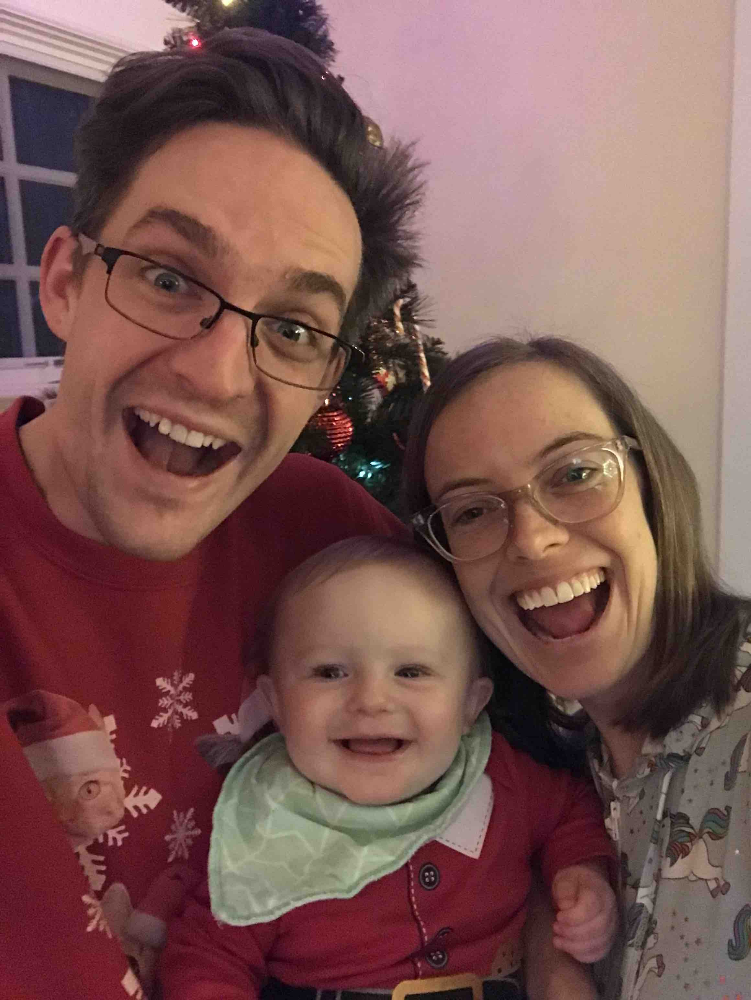

Hi I'm Peter! Here are a few things that might be interesting about me. ¯\\\_(ツ)_/¯

I'm the second oldest of six boys.

Started a family of my own with my awesome wife Amanda and our new baby Rowan.

I work as a programmer though I'm actually formally trained as an American Sign
Language interpreter. Life is funny and I'm often surprised at the path
that got me there.

I like woodworking. Particually turning bowls on a lathe. Interestingly enough
it was my older brother [Ashton](https://ashton.snelgrove.family) that turned
me on to it. Pun intended.

